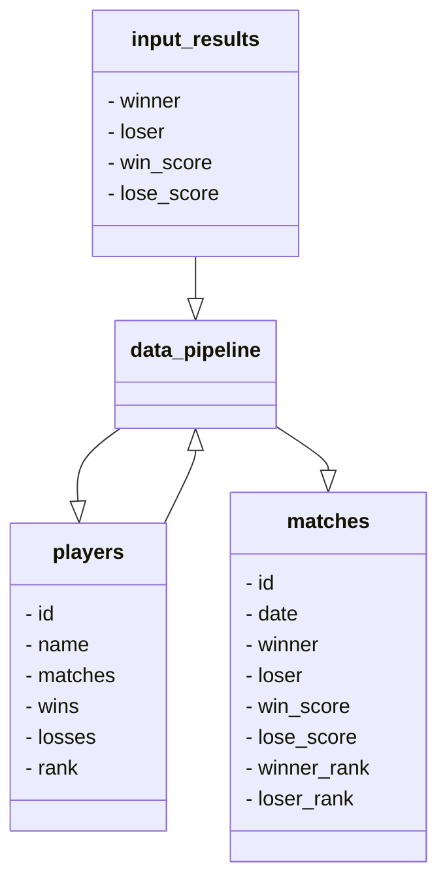

```mermaid
classDiagram

input_results --|> data_pipeline
data_pipeline --|> players
players --|> data_pipeline
data_pipeline --|> matches

matches : - id
matches : - date
matches : - winner
matches : - loser
matches : - win_score
matches : - lose_score
matches : - winner_rank
matches : - loser_rank

players : - id
players : - name
players : - matches
players : - wins
players : - losses
players : - rank

input_results : - winner
input_results : - loser
input_results : - win_score
input_results : - lose_score

```